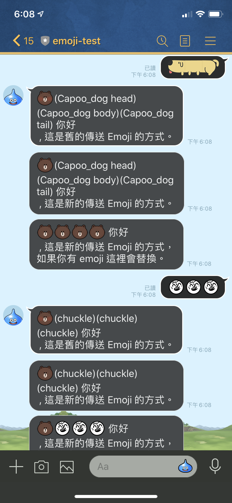
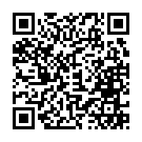

LINE Emoji demo bot: A sample LINE Chatbot to demo LINE emoji feature (send/receive) by Golang
==============

   

For LINE Emoji API, please check:

- [https://developers.line.biz/en/news/2020/04/14/messaging-api-update-april-2020/](https://developers.line.biz/en/news/2020/04/14/messaging-api-update-april-2020/)
- [https://developers.line.biz/en/news/2020/05/12/messaging-api-update-may-2020/](https://developers.line.biz/en/news/2020/05/12/messaging-api-update-may-2020/)

How to use it
=============

1. Scan this QR code add LINE Friend.

2. Input any string with emoji.

3. The echo bot will reply you three kinds of way message:

   1. Original emoji way with send fixed emoji (Brown) (**it is deprecated.**)
   2. New Emoji API with send fixed emoji (Brown)
   3. Echo what user send to the bot. (if your emoji is not [standard one](https://d.line-scdn.net/r/devcenter/sendable_line_emoji_list.pdf)). It will be replaced by Brown one.

    

Installation and Usage
=============

More detail, please check my [LINE Bot Template project](https://github.com/kkdai/LineBotTemplate).

License
---------------

Licensed under the Apache License, Version 2.0 (the "License");
you may not use this file except in compliance with the License.
You may obtain a copy of the License at

http://www.apache.org/licenses/LICENSE-2.0

Unless required by applicable law or agreed to in writing, software
distributed under the License is distributed on an "AS IS" BASIS,
WITHOUT WARRANTIES OR CONDITIONS OF ANY KIND, either express or implied.
See the License for the specific language governing permissions and
limitations under the License.

